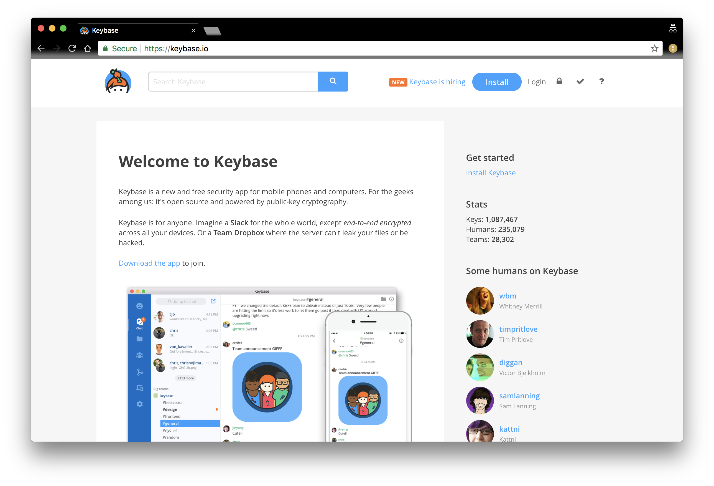
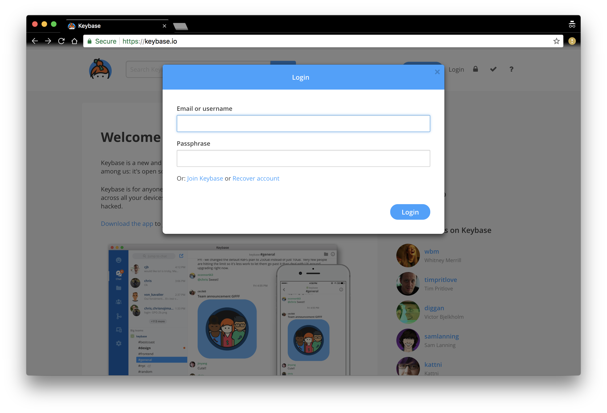
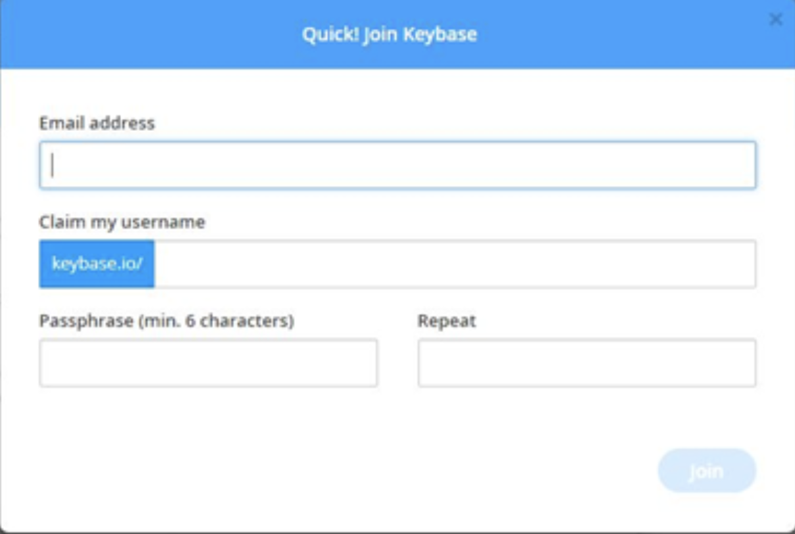
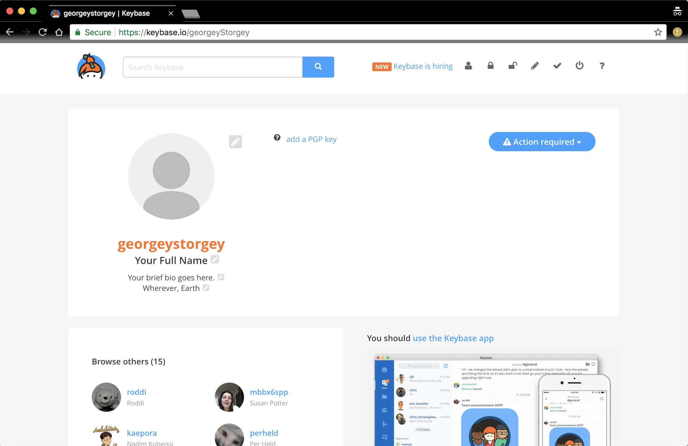
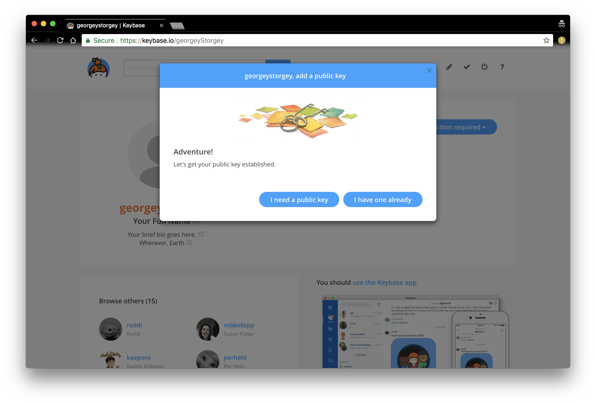
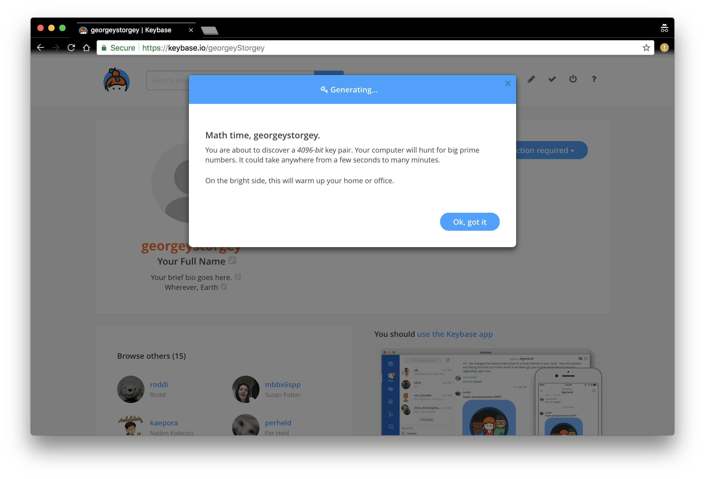
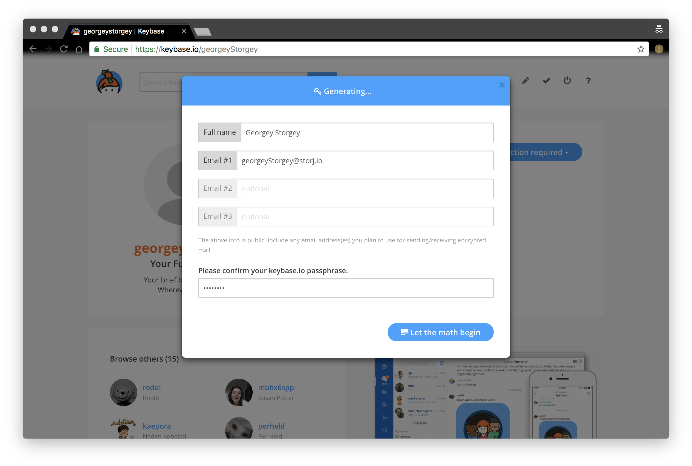
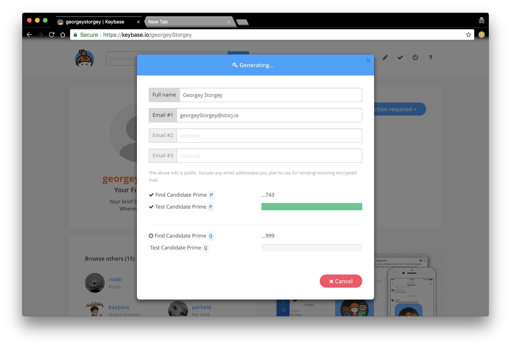
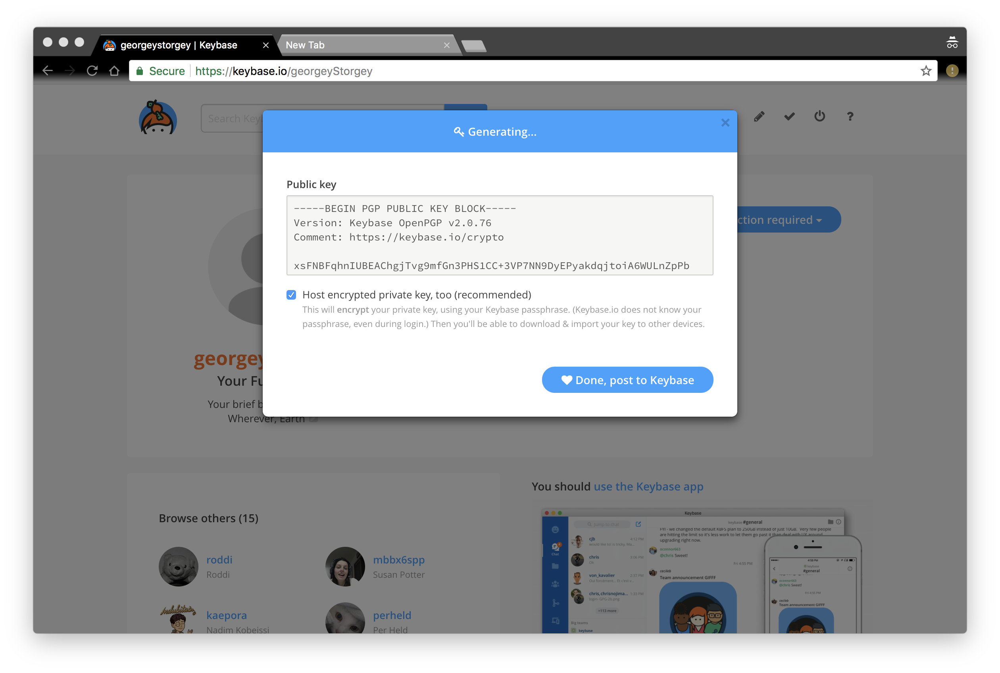
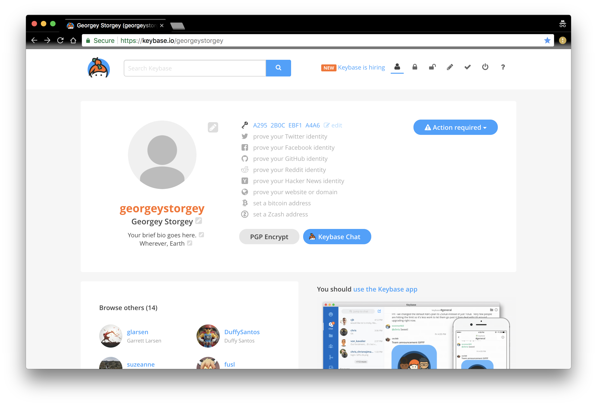

Bounty Details
==============

The Storj community is large, consisting of developers, farmers, partners, and users whom possess a wide range of skill sets. Our goal for the bounty program is to be inclusive, allowing our whole community to contribute. As such, we are excited to offer technical and nontechnical bounties. These bounties will continuously be updated - so check in at least once a week to see what's new! 

 Technical bounties will be added soon. Check out our `twitter`_ for updates!

.. _twitter: https://twitter.com/storjproject
 

Nontechnical Bounties
----------------------

There are a few ways you can earn bounties that don't involve code!

* :ref:`Translations`
* :ref:`Guest Writer`
* :ref:`Attending Conferences and Events`
* :ref:`Promotional Bounties`
* :ref:`How to Submit Requests for Nontechnical Bounties`
* :ref:`How Nontechnical Bounties are Reviewed`

.. _translations:

Translations
~~~~~~~~~~~~~

Our community is world wide where people may not speak English. For our content to be accessible to everyone, we need translators. It's our goal to be inclusive and ensure everyone invested in Storj gets updates. Having translations of newsletters, blogs, and other content assists in this initiative. 

Bounties for content translations are the following:

+-------------+-----------------+---------------------+---------------+-------------------+
| Content     | Date Active     | Link                | Word Count    | Payout            |            
+=============+=================+=====================+===============+===================+
| Storj Bytes | 12/22           | `Q4 2017`_          | 1672          | $125 USD in STORJ |
+-------------+-----------------+---------------------+---------------+-------------------+
| Storj Bits  | 12/22           | `Token Lockup`_     | 604           | $50 USD in STORJ  |
+-------------+-----------------+---------------+-----+---------------+-------------------+
| Code Conduct| 12/22           | `Code Of Conduct`_  | 444           | $50 USD in STORJ  |
+-------------+-----------------+---------------------+---------------+-------------------+

Languages needed for translations of the following content:

+----------------+-----------------+---------------+-----------------+
|  Language      | Story Bytes     | Storj Bits    | Code of Condcut |
+================+=================+===============+=================+
| French         | Incomplete      | Incomplete    | Incomplete      | 
+----------------+-----------------+---------------+-----------------+
| Italian        | Incomplete      | Incomplete    | Incomplete      |
+----------------+-----------------+---------------+-----------------+
| Dutch          | Incomplete      | Incomplete    | Incomplete      |
+----------------+-----------------+---------------+-----------------+
| German         | Incomplete      | Incomplete    | Incomplete      |
+----------------+-----------------+---------------+-----------------+
| Cantonese      | Incomplete      | Incomplete    | Incomplete      |
+----------------+-----------------+---------------+-----------------+
| Mandarin       | Incomplete      | Incomplete    | Incomplete      |
+----------------+-----------------+---------------+-----------------+
| Simp.Chinese   | Incomplete      | Incomplete    | Incomplete      |
+----------------+-----------------+---------------+-----------------+
| Japanese       | Incomplete      | Incomplete    | Incomplete      |
+----------------+-----------------+---------------+-----------------+
| Romainan       | Incomplete      | Incomplete    | Incomplete      |
+----------------+-----------------+---------------+-----------------+
| Arabic         | Incomplete      | Incomplete    | Incomplete      |
+----------------+-----------------+---------------+-----------------+
| Spanish        | Incomplete      | Incomplete    | Incomplete      |
+----------------+-----------------+---------------+-----------------+
| Korean         | Incomplete      | Incomplete    | Incomplete      |
+----------------+-----------------+---------------+-----------------+
| Hindi          | Incomplete      | Incomplete    | Incomplete      |
+----------------+-----------------+---------------+-----------------+
| Portugese      | Incomplete      | Incomplete    | Incomplete      |
+----------------+-----------------+---------------+-----------------+
| Russian        | Incomplete      | Incomplete    | Incomplete      |
+----------------+-----------------+---------------+-----------------+
| Serbo-Croation | Incomplete      | Incomplete    | Incomplete      |
+----------------+-----------------+---------------+-----------------+

Relationship between word count and payouts is done from the English version:

+-------------+-------------------+
| Word Count  | Payout            |           
+=============+===================+
| 100-400     | $25 USD in STORJ  |
+-------------+-------------------+
| 401-800     | $50 USD in STORJ  |
+-------------+-------------------+
| 801-1200    | $75 USD in STORJ  |
+-------------+-------------------+
| 1201-1600   | $100 USD in STORJ |
+-------------+-------------------+
| 1601-2000   | $125 USD in STORJ |
+-------------+-------------------+

Please check out :ref:`How to Submit Requests for Nontechnical Bounties` if you'd like to do translations. 

.. _Q4 2017: http://blog.storj.io/post/168761643398/storj-bytes-community-newsletter-q4-2017
.. _Token Lockup: http://blog.storj.io/post/168735310988/an-announcement-about-storj-token-lock-ups
.. _Code Of Conduct: http://bounty-program.readthedocs.io/en/latest/code-of-conduct.html

.. _Guest Writer:

Guest Writer
~~~~~~~~~~~~~

Storj is excited to feature guest writers on our community blog! We welcome anyone from the community to contribute ideas pertaining to technology, blockchain, future-forward thoughts on the industry & technology, and retrospectives of events and talks attended. Please check out :ref:`How to Submit Requests for Nontechnical Bounties` if you want to be a guest writer. We'll have a committee review your submission and reply back within a week. 

.. note:: Please do not submit your blog post without approval of your proposal or abstract.

Benefits for being a guest writer:
	
	* $100 - $500 USD in STORJ tokens 
	* You'll get some swag
	* Bio at the end of every post with your picture
	* We'll include your website and social media links

Expectations for writers:
	
	* Content must be original and not plagerized
	* Clarity - points should be concise 
	* Concreteness - points should be illustarted and supported

.. _Attending Conferences and Events:

Attending Conferences and Events
~~~~~~~~~~~~~~~~~~~~~~~~~~~~~~~~~

Storj has some exciting plans to visit some countries and attend events where some of our community members live. Unfortunately, we won't be able make all the events, workshops, conferences, and meetups that are developer and blockchain-focused. So, we're offerring some bounties to our community for the following:

	* Creating a monthly Storj meetup
	* Attending blockchain and developered focused conferences/events & representing Storj 
	* Hosting a workshop about integrating the Storj data layer into applications 
	* Giving a talk about Storj
	* Being featured in a podcast or video

.. note:: Want to represent Storj in a way that's not listed above? Email us at: bounty@storj.io for consideration. 

Benefits for creating and/or attending events, conferences, and meetups:
	
	* $100-$1000 USD in STORJ tokens
	* We'll send swag for you and/or the event
	* We'll feature you and the event on our community
	* Storj will support any events or meetups by providing food and beverages 
	* If you're speaking at a conference and referencing Storj, email us at bounty@storj.io to let us know additional support you may need

.. note:: Did we miss something that you may need? Email us at bounty@storj.io.

Please check out :ref:`How to Submit Requests for Nontechnical Bounties` if you'd like to create and/or host meetups, conferences, events, or do speaker engagements.  We'll have a committee review your submission and reply back within a week.

.. _Promotional Bounties:

Promotional Bounties
~~~~~~~~~~~~~~~~~~~~~

Storj is excited to offer promotional bounties that are meant to be fun. The promotional bounty will change weekly. Always check this page to see if there are any updates!

January 08, 2018 - January 15, 2018 bounty:
    First 20 people to tweet at us with their Storj stickers on their labtops will get 5 STORJ tokens!

.. _How to Submit Requests for Nontechnical Bounties:

How to Submit Requests for Nontechnical Bounties
~~~~~~~~~~~~~~~~~~~~~~~~~~~~~~~~~~~~~~~~~~~~~~~~~

In general, please include:
	* Full name
	* Short bio about who you are 
	* Links to previous material you've done
	* Rocket.Chat alias
	* How you've interacted with Storj - i.e. developer, farmer, token holder, and/or partner
	* Which bounty interests you 

Translations:
	* In addition to the above bullet points: 
		* Please include which language(s) you want to translate. 

Guest Writer
	* In addition to the above bullet points
		* Please include a 3-5 sentence summary of your blog proposal

Attending Conferences and Events
	* In addition to the above bullet points, please include:
		* Detail information about the event, conference, and/or meetup-  please include any links that are relevant
		* How Storj can support you: food, beverages, and etc 
		* Feel free to include anything else you may need
	
All requests should go to bounty@storj.io. 

.. note:: Deadlines for requests to be reviewed for the current week will be 6PM UTC on Wednesdays. 

.. _How Nontechnical Bounties are Reviewed:

How Nontechnical Bounties are Reviewed
~~~~~~~~~~~~~~~~~~~~~~~~~~~~~~~~~~~~~~~

There is a committee of 6 people that review requests once a week on Thursdays at 6pm-7pm UTC. We will send a reply on Thursdays to notify you of the decision. 

GPG Signatures
---------------

It’s our policy that any financial transactions submitted, must go through an extra layer of security to prevent phishing and scamming. We’ve added an additional layer of security to prevent this. One way to prove an identity is through Keybase via GPG signed messaging. Please follow the guide below to get setup. If you have additional questions, please reach out on `Rocket Chat`_ , specifically the #gpg-signature channel. 

.. _Rocket Chat: https://storj.io/community.html

* :ref:`Setup for GPG Signature`

.. _Setup for GPG Signature: 

STEP 1: Navigate to the Keybase homepage
----------------------------------------

`Keybase`_ provides public keys that can be trusted without you having to talk to the person of interest. If you don't have an account, you can get started by creating a new account on the `Keybase homepage`_. Click on ``Login`` on the right side of the headers:

.. _Keybase: https://keybase.io/docs/server_security/following

.. _Keybase homepage: https://keybase.io/

STEP 2
-------

After you've clicked on the ``Login`` button, you should see this pop-up:

Click on ``Join Keybase``. 

STEP 3
-------

Enter your email address, username (easiest to use your rocketchat alias), and choose a strong passphrase. Do not use create easy, hackable passwords like `123456`. After your information is entered, the screen should look something like this:

Click on ``Activate!``.

STEP 4
-------

After you've clicked on the ``Activate!`` button, you should be navigated to a dashboard like this:

Click on ``add a PGP Key``.

STEP 5
-------

You should get the following pop-up:

If you have a PGP key, you can enter it via the option ``I have one already``. In this tutorial, we assume you don’t have one and need a public key. Please click on ``I need a public key`` to proceed.

STEP 6
-------

After you've clicked on ``I need a public key``, you should see this: 

Click on ``Ok, got it``.

STEP 7
-------
Shortly after, you'll get a screen where you should enter your name and email address(es) you want to associate with your public key. After you've filled out the information, it should look like this:

Click on ``Let the math begin``.

STEP 7
-------

After you've click, there is going to be some magic that happens in the background:

After a minute or so you'll see your public key:

Click on ``Done post to Keybase``.

STEP 8
-------

You have successfully created a GPG Key and linked it to your account. The Dashboard should change to look like this:

With this screen you’re finally able to send encrypted messages and have a public place to verify all your other accounts. Please get your `GitHub`_ and `Twitter`_ identity accounts approved. 

.. _GitHub: https://github.com/

.. _Twitter: https://twitter.com/
